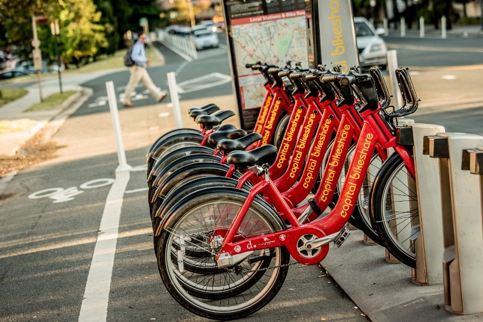

```{r setup, include=FALSE}
knitr::opts_chunk$set(echo = TRUE, warning = FALSE, message = FALSE)
library(tidyverse)
library(caret)
library(rpart)
library(rpart.plot)
library(randomForest)
library(ROCR)
library(ggplot2)
library(MLmetrics)
library(mltools)
library(knitr)
library(plotly)
library(DT)
library(rmarkdown)
```
<!-- Phase 1: Idea Development --> 

<p><br></p>

### <b><u>ML Question/Problem:</u> Develop a model that can predict the number of bikes rented.</b>

## Background
Bike shares are a novel type of bike rental that has been fully automated, from membership to rental and return. These systems allow users to easily rent bikes from one location and return them to other locations around the city and are part of a larger trend of shared micromobility around the world.

For our project, we chose a dataset on the number of bike share rentals per hour based on factors such as weather, season, time of day, day of week, and hour of day. The source of the dataset is from [Fanaee-T and Gama (2014)](https://archive.ics.uci.edu/ml/datasets/Bike+Sharing+Dataset?fbclid=IwAR32pIoKhPoXNbwORbZZNBnIvD1iqwkQprMIFTXLTJDII5XzLP0GkpBrZG0), who compiled publicly available ride data from Capital Bikeshare in Washington, D.C. for 2011-2012 with publicly available weather and holiday data. 

We picked this data-set due in part due to the size, with 17,000+ rows available and a good mix of categorical and continuous data. The bikeshare data can also tell us about the traffic, environmental, and health issues in the city so it is an interesting data set to look at. Furthermore, a working model can used to identify optimal conditions for more bike share programs. Bike share companies can also better allocate their resources by being able to predict where they will have the most business.

<i>Our group wanted to know if we could accurately predict the number of bikes rented out based on a number of factors, including weather, season, time of day, and type of day (weekday, workday, holiday).</i>

<u>Evaluation Metric:</u> We will be looking at the <b>mean squared error (MSE)</b> as our main evaluation criteria. It measures the amount of error between our model and the actual values, which is what we want to optimize on. We hope to lower the MSE as much as possible. We will also look at the R<sup>2</sup> value. <b>R<sup>2</sup></b> measures the proportion of the total variation in the dependent variable that can be explained by the independent variables in the model.

Other research published using this data set:
https://link.springer.com/article/10.1007/s13748-013-0040-3

<!-- Phase 2: Data Prep & Problem Exploration -->
```{r, include=FALSE}
# Pre-processing Data
bike <- read.csv("bike-hour.csv")
rownames(bike) <- bike$instant

# Fix data type
str(bike)

bike <- bike %>% 
  select(-c(instant, dteday, casual, registered, yr)) %>% 
  mutate_at(c("season", "mnth", "hr", "holiday", "weekday", "workingday", "weathersit"), as.factor)

str(bike)
view(bike)
```


## Exploratory Analysis{.tabset}
### Boxplot:Five Number Summary of Target Variable
```{r}
# fivenum(bike$cnt)
boxplot(bike$cnt)
text(y=fivenum(bike$cnt),labels=fivenum(bike$cnt), x=1.3)
```

### Distribution of Bike Counts
```{r}
hist(bike$cnt, col = 'red', xlab='Count', ylab='Frequency', main = 'Bike Count Distribution')
```

### Bikes Rented by Hour
```{r}
bike_tbl <- bike %>% group_by(hr) %>% 
  summarise(average_count=mean(cnt),
            .groups = 'drop')

ggplot(bike_tbl, aes(x = hr, y = average_count)) +
    geom_bar(stat = 'identity') + ggtitle("Bikes per Hour")
```

## {-}

One bike is by far the most common amount of bikes rented out at a time. The data set does not include data where there were no bikes checked out, which is why the morning hours have a less data points than waking hours. In the data, it is most common to have 40-281 bikes rented in a given hour, however there are outliers of large surges in bike rentals. 

We think the biggest factor affecting the number of bicycles rented will be the time of day, or what hour it is. Grouping our data by hour and then displaying it in a bar chart with count shows us a distribution that we expect, with the most active hours being the rush hours, with a steady count throughout the day dropping off as it gets later and later into the night and the following morning.

## Initial Model Building
<b>Method:</b> We plan to use a random forest because it reduces over-fitting compared to decision trees and help with increasing the accuracy of the prediction. It also handles the categorical and continuous values well and removes the need for normalizing.

```{r, include=FALSE}
# Split Data
sample_rows = 1:nrow(bike)
set.seed(2023)
test_rows = sample(sample_rows,
                   dim(bike)[1]*.10,
                   replace=FALSE)
train = bike[-test_rows,]
test = bike[test_rows,]

# Calculate Initial mtry
mytry_tune <- function(x){
  xx <- dim(x)[2]-1
  sqrt(xx)
}

mytry_tune(bike) # 3.316625 -> start with 4

set.seed(2023)
rf1 = randomForest(cnt~.,
                   train,
                   ntree = 1000,
                   mtry = 4,
                   replace = TRUE,
                   sampsize = 100,
                   importance = TRUE,
                   do.trace = TRUE,
                   keep.forest = TRUE,
                   keep.inbag = TRUE)
```

```{r}
param1 <- data.frame("Parameter" = "ntree", "Value"= 1000)
param1[nrow(param1)+1,] <- c("mtry",4)
param1[nrow(param1)+1,] <- c("sampsize",100)
paged_table(param1)
```

## Initial Model Evaluation{.tabset}
### Variable Importance
```{r}
importances <- as.data.frame(importance(rf1))
importances$names <- rownames(importances)

ggplot(importances, aes(x=names, y=`%IncMSE`)) +
  geom_segment(aes(x=names, xend=names, y=0, yend=`%IncMSE`)) +
  geom_point(aes(size=IncNodePurity)) +
  theme_light() + 
  coord_flip()
```

<b>%IncMSE</b> is the increase in mean squared error (MSE) of the predictions, estimated with out-of-bag cross validation, as a result of the variable being randomly shuffled. <b>IncNodePurity</b> is the measure of how much model error increases when the variable is randomly permuted. The higher the value for either metric, the more important a variable is. As seen, from the plot, our initial assumption that time of day (hr variable) would be the most important is correct.

### Change in Mean Square Error
```{r}
# rf_density <- density(rf1$oob.times)
# plot(rf_density)

rm(fig)
fig <- plot_ly(x=1:rf1$ntree, y=rf1$mse, type = 'scatter', mode = 'lines') %>% layout(title = 'MSE For Each Iteration', xaxis = list(title = 'Number of Trees'), yaxis = list(title = 'MSE'))
fig
```

Not much difference after about first 400 trees. The MSE are still pretty high, only going down to 13,000.

## {-}

<!-- Phase 3: Solution Development --> 
## Optimization/Tuning Model{.tabset}
<u>ntree was changed to 500 as there was not much change at higher trees.</u>

### (1) Alter mtry
```{r, include=FALSE}
# Change mtry
set.seed(2023)
rf2 = randomForest(cnt~.,
                   train,
                   ntree = 500,
                   mtry = 7,
                   replace = TRUE,
                   sampsize = 100,
                   importance = TRUE,
                   do.trace = TRUE,
                   keep.forest = TRUE,
                   keep.inbag = TRUE)
set.seed(2023)
rf3 = randomForest(cnt~.,
                   train,
                   ntree = 500,
                   mtry = 11,
                   replace = TRUE,
                   sampsize = 100,
                   importance = TRUE,
                   do.trace = TRUE,
                   keep.forest = TRUE,
                   keep.inbag = TRUE)
```

```{r}
rm(fig2)
fig2 <- plot_ly(x=1:rf2$ntree, y=rf2$mse, type = 'scatter', mode = 'lines') %>% layout(title = 'MSE For Each Iteration', xaxis = list(title = 'Number of Trees'), yaxis = list(title = 'MSE'))
fig2

rm(fig3)
fig3 <- plot_ly(x=1:rf3$ntree, y=rf3$mse, type = 'scatter', mode = 'lines') %>% layout(title = 'MSE For Each Iteration', xaxis = list(title = 'Number of Trees'), yaxis = list(title = 'MSE'))
fig3

mtry_config <- data.frame("mtry"= 4, "mse"= min(rf1$mse), "rsq"=max(rf1$rsq))
mtry_config[nrow(mtry_config)+1,] <- c(7,min(rf2$mse),max(rf2$rsq))
mtry_config[nrow(mtry_config)+1,] <- c(11,min(rf3$mse),max(rf3$rsq))
paged_table(mtry_config)
```

### (2) Alter Sample Size
```{r, include=FALSE}
# Change sampsize
set.seed(2023)
rf4 = randomForest(cnt~.,
                   train,
                   ntree = 500,
                   mtry = 4,
                   replace = TRUE,
                   sampsize = 500,
                   importance = TRUE,
                   do.trace = TRUE,
                   keep.forest = TRUE,
                   keep.inbag = TRUE)
set.seed(2023)
rf5 = randomForest(cnt~.,
                   train,
                   ntree = 500,
                   mtry = 4,
                   replace = TRUE,
                   sampsize = 1000,
                   importance = TRUE,
                   do.trace = TRUE,
                   keep.forest = TRUE,
                   keep.inbag = TRUE)
```

```{r}
rm(fig4)
fig4 <- plot_ly(x=1:rf4$ntree, y=rf4$mse, type = 'scatter', mode = 'lines') %>% layout(title = 'MSE For Each Iteration', xaxis = list(title = 'Number of Trees'), yaxis = list(title = 'MSE'))
fig4

rm(fig5)
fig5 <- plot_ly(x=1:rf5$ntree, y=rf5$mse, type = 'scatter', mode = 'lines') %>% layout(title = 'MSE For Each Iteration', xaxis = list(title = 'Number of Trees'), yaxis = list(title = 'MSE'))
fig5

sampsize_config <- data.frame("sampsize"= 100,"mse"= min(rf1$mse),"rsq"=max(rf1$rsq))
sampsize_config[nrow(sampsize_config)+1,] <- c(500,min(rf4$mse),max(rf4$rsq))
sampsize_config[nrow(sampsize_config)+1,] <- c(1000,min(rf5$mse),max(rf5$rsq))
paged_table(sampsize_config)
```

## {-}

The two evaluation metrics improve with increasing mtry, but having an mtry=11 would utilize all variables and decrease the randomness of a random forest, which defeats the purpose of utilizing it compared to just a decision tree. Moreover, there is not much of an improvement from mtry=7 to mtry=11.

The two evaluation metrics also improve with increasing sample size. Since, we have a relatively large data set, we can utilize a larger sample size. Furthermore a sampsize=1000 greatly improves our metrics. However, the tradeoff is possibility of overfitting our model.

## Final Model
```{r, include=FALSE}
# Optimize Hyperparameters
set.seed(2023)
rf6 = randomForest(cnt~.,
                   train,
                   ntree = 500,
                   mtry = 7,
                   replace = TRUE,
                   sampsize = 1000,
                   importance = TRUE,
                   do.trace = TRUE,
                   keep.forest = TRUE,
                   keep.inbag = TRUE)

```

#### <u>Model Summary</u>
```{r}
importances6 <- as.data.frame(importance(rf6))
importances6$names <- rownames(importances6)

ggplot(importances6, aes(x=names, y=`%IncMSE`)) +
  geom_segment(aes(x=names, xend=names, y=0, yend=`%IncMSE`)) +
  geom_point(aes(size=IncNodePurity)) +
  theme_light() + 
  coord_flip()

rm(fig6)
fig6 <- plot_ly(x=1:rf6$ntree, y=rf6$mse, type = 'scatter', mode = 'lines') %>% layout(title = 'MSE For Each Iteration', xaxis = list(title = 'Number of Trees'), yaxis = list(title = 'MSE'))
fig6

paramf <- data.frame("Parameter/Metric" = "ntree", "Value"= 500)
paramf[nrow(paramf)+1,] <- c("mtry",7)
paramf[nrow(paramf)+1,] <- c("sampsize",1000)
paramf[nrow(paramf)+1,] <- c("mse",min(rf6$mse))
paramf[nrow(paramf)+1,] <- c("rsq",max(rf6$rsq))
paged_table(paramf)
```


#### <u>Model Prediction on Test Set</u>
```{r, include=FALSE}
# Predict on Test Set
test_pred <- predict(rf6, test)
result <- test
result$pred <- test_pred
# Calculate MSE
result_mse <- mean((result$cnt - result$pred)^2)
# Calculate R2
ss_res <- sum((result$cnt - result$pred)^2)
ss_tot <- sum((result$cnt - mean(result$cnt))^2)
result_r_squared <- 1 - ss_res / ss_tot
```

```{r}
predval <- data.frame("Metric" = "MSE", "Value"= result_mse)
predval[nrow(predval)+1,] <- c("R-Squared",result_r_squared)
paged_table(predval)
```

<!-- Phase 4: Solution Deployment --> 
## Fairness Assessment
A fairness assessment is not necessary, since there are no protected classes in our dataset.

## Conclusion
Our final model was fairly competent, with ~81% of the variance being captured by the model. The most important factor is 'hr', which was way more important than any other variable. Our R<sup>2</sup> value was 0.81 and 0.82 when predicting on the test set, which does a decent job at predicting the bike count, with some error.

This model still has limitations. A random forest model can't extrapolate, because the range of possible values the model outputs are the range of values in the dataset. Especially for the topic of bike sharing, extrapolating is important because the maximum of values are constantly increasing. To be fair, extrapolating growth into the future would be hard for any machine learning model. What our model is useful for is identifying the features that matter the most to affecting bike rental count and identifying how much bike rental count is affected (or can be predicted by) the factors in our dataset. This can still be helpful in identifying allocation of resources to our different locations.

A problem with our dataset was that the hours where there were no bike rentals (cnt==0) were not included in the dataset, so our model couldn't capture hours like those. 

## Future Work
In the future, we could include more features into our dataset, include 0 counts into our dataset, include a larger timespan by building and cleaning the data straight from Capital Bike, and/or use a different type of model. Moreover, it might make sense to only look at the data within specific times of the day, such as eliminating non-awake hours, as these small values can affect the predictive elements of the model and increase the need for more overfitting to better the evaluation metric. Furthermore, depending on the business need, it might be good to build a model without time of day, so we can see if environmental factors (ie weather) can also be used as a good predictor of rental rates, which can be useful in expanding bikeshare to other areas.

Using machine learning in this way to predict bike rental counts is very promising, given the high R^2 value and the high variance explained by our model. Given this, future work should have very good results.

## References
[1] https://link.springer.com/article/10.1007/s13748-013-0040-3

[2] https://nacto.org/shared-micromobility-2020-2021/

[3] https://nacto.org/wp-content/uploads/2022/12/2020-2021_shared_micro_snapshot_Dec7_2022.pdf

[4] https://ride.capitalbikeshare.com/about#:~:text=The%20History%20of%20Capital%20Bikeshare,its%20two%20years%20of%20operation